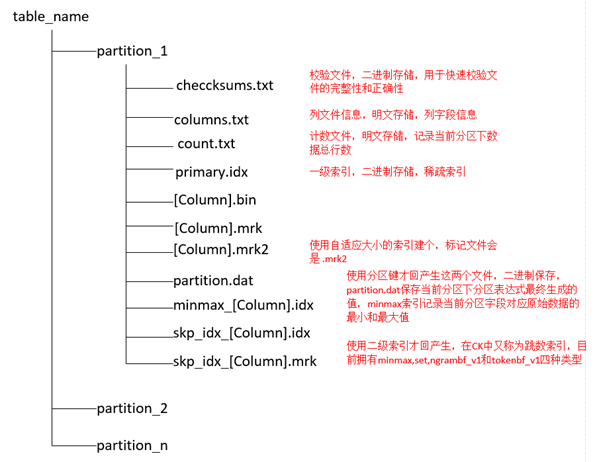
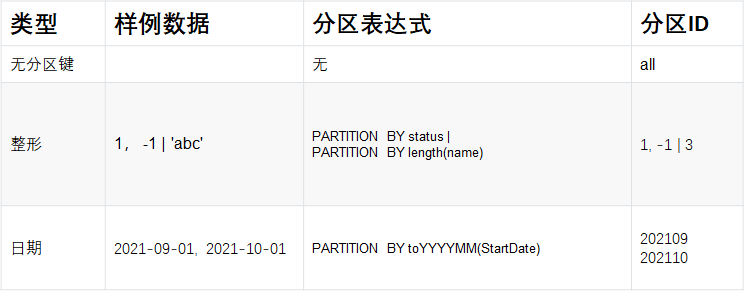
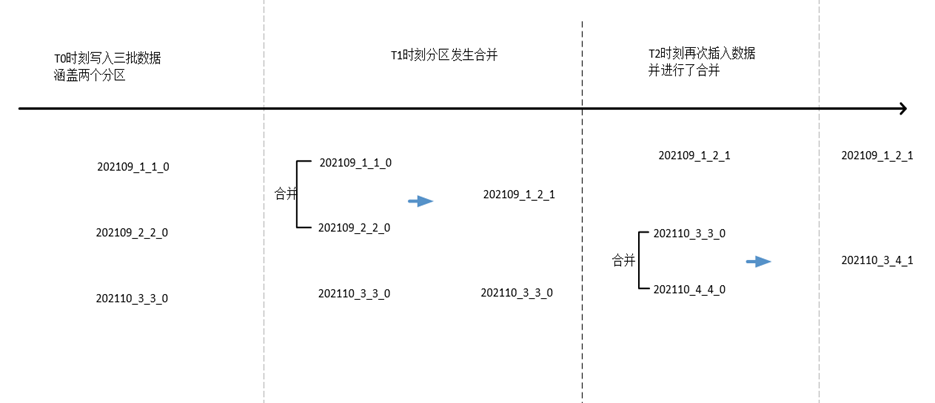
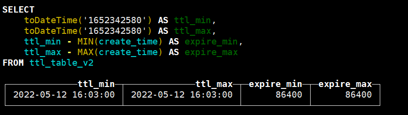

### ClickHouse 存储结构

#### 前言

> ClickHouse学习中，我用到最多的是MergeTree表引擎，本次文章就是总结MergeTree表引擎关键词介绍，ClickHouse的存储结构，分区规则，稀疏索引，和为何检索快速中的MarkRang步骤知识点，还有记得关键一点**ClickHouse的很多操作都是发生在合并分区的时候**

#### MergeTree表引擎关键词介绍

- PARITION BY [选填]
  - 分区键，可以是单个字段，也可以是元组形式组成的多个字段，若不声明，则会成成一个partiitionID为all的分区。
- ORDER BY [必填]
  - 排序键，单/元组，PRIMARY KEY 不设置默认和排序键相同
- PRIMARY KEY [选填]
  - 会以此字段生成一级索引，加快查询速度。
- SAMPLE BY [选填]
  - 抽样表达式，用于声明以何种标准进行采样
- SETTINGS: 
  - index_granularity [选填]
    - 默认值8192，索引的粒度，每隔8192行数据会生成一条索引（稀疏索引）
  - index_granularity_bytes [选填]
    - 在19.11版本之前，ClickHouse只支持股低昂大小的索引间隔，由index_granularity控制。新版本之中，增加了自适应间隔大小的特性，即根据每一批次写入数据的体量大小，动态划分间隔大小，数据的体量大小正是由index_granularity_bytes参数控制，默认为10M(10*1024*1024)，设置为0表示不启动自适应功能
  - enable_mixed_granularity_parts [选填]
    - 设置是否开启自适应索引间隔的功能，默认开启
  - merge_with_ttl_timeout [选填]
    - 从19.16版本开始，MergeTree提供了数据TTL的功能，下面会介绍TTL功能（此处merge_with_ttl_timeout 参数表示TTL默认的合并频率，默认值为86400秒, 即1天）若此值被设置的过小，可能会带来性能损耗
  - storage_policy [选填]
    - 从19.15版本开始，MergeTree提供多路径存储策略，配置项指定定义好的存储策略，存储策略一旦设置，不能修改。

#### MergeTree存储文件结构

以下是MergeTree大多的存储结构，在使用某些特殊功能还会生成其他的文件，如使用ttl会多生成一个ttl.txt文件



打开ClickHouse对应table的文件件，会发现有一些不同的分区，MergeTree的分区规则如下介绍

- PartitionID_MinBlockNum_MaxBlockNum_Level
  - PartitionID: 分区ID
  - MinBlockNum 和 MaxBlockNum
    - 最小数据块标号与最大数据块编号。每当创建一个新分区，计数就会加1.
    - 合并时
      - MinBlockNum取同一分区内所有目录中最小的MinBlockNum值
      - MaxBlockNum取同一分区内所有目录中最大的MaxBlockNum值
  - Level
    - 某个分区被合并过得次数，每新建的个分区的起始值为0

常用分区字段类型



分区合并规则示例



#### MergeTree数据TTL（也是发生在合并分区的时候）

> TTL即Time To Live，它表示数据的存活时间。在MergeTree中，可以为某个列字段或者整张表设置TTL，当时间到达时，如果是列字段级别的TTL，则会删除这行数据的这一列的数据内容；若是表级别的TTL，则会删除这张表符合到期的数据；若同事设置了列级别和表级别的TTL，则会以先到期的那个为主。

不论那个级别的TTL都需要依托某个DateTime或Date类型的字段，通过这个时间字段的INTERVAL操作，表述过期时间(下面例子标识存活时间是time_col时间的3天后过期) INTERVAL完整的操作包括SECOND、 MINUTE、HOUR、DAY、WEEK、MONTH、QUARTER和YEAR。

```sql
TTL time_col + INTERVAL 3 DAY
```

列级别修改TTL与表级别修改TTL（没有提供取消方法，但可以修改）

```sql
// 列级别TTL修改
ALTER TABLE ${table_name} MODIFY COLUMN ${column_name} ${column_type} TTL ${time_column} + INTERVAL 1 DAY
// 表级别TTL修改
ALTER TABLE ${table_name} MODIFY TTL ${time_column} + INTERVAL 3 DAY
```

##### TTL的运行原理

若一张表被设置了TTL表达式，在写入数据时，会以数据分区为单位，在每个分区目录内生成一个名为ttl.txt的文件；入若ttl_table_v2被设置了code列存在TTL，同时设置了表级别的TTL，则再写入数据后，每个分区目录内都会生成ttl.txt文件。

```bash
# pwd
/data10/clickhouse/data/default/ttl_table_v2/202205_2_2_0
# ll
...
-rw-r----- 1 root root  30 5月   9 11:40 create_time.bin
-rw-r----- 1 root root  48 5月   9 11:40 create_time.mrk2
-rw-r----- 1 root root   8 5月   9 11:40 primary.idx
-rw-r----- 1 root root 129 5月   9 11:40 ttl.txt
...
# cat ./ttl.txt
ttl format version: 1
{"columns":[{"name":"code","min":1652256240,"max":1652256240}],"table":{"min":1652342580,"max":1652342580}}
```

可以发现MergeTree是通过遗传JSON配置保存TTL的相关信息：

- columns用于保存列级别TTL信息
- table用户保存表级别TTL信息
- min和max保存了当前数据分区内，TTL指定日期字段的最大值、最小值，分别与INTERVAL表达式计算后的得时间戳，如下图table级别的ttl的min和max的执行结果，table TTL表达式create_time + INTERVAL 1 DAY



知道了TTL信息记录方式，大致处理逻辑如下：

1. MergeTree以分区目录为单位，通过ttl.txt文件记录过期时间，并将其作为后续的判断依据
2. 每当写入一批数据时，都会基于INTERVAL表达式的计算结果为这个分区生成ttl.txt文件
3. **只有在MergeTree合并分区时，才会触发删除TTL过期数据的逻辑**
4. 在选择删除的分区时，会使用贪婪算法，它的算法规则是尽可能找到会最早过期的，同时 年纪又是最老的分区（合并次数更多，MaxBlockNum更大的）。
5. 如果一个分区内某一列数据因为TTL到期全部被删除了，那么在合并之后生成的新分区目 录中，将不会包含这个列字段的数据文件（.bin和.mrk）。

注意

1. TTL默认的合并频率由MergeTree的merge_with_ttl_timeout参数控制，默认86400秒(1天)。它维护的是一个专有的TTL任务队列。有别于MergeTree的常规合并任务，如果这个值被设置的过小，可能会带来性能损耗。 

2. 除了被动触发TTL合并外，也可以使用optimize命令强制触发合并.

3. ClickHouse目前虽然没有提供删除TTL声明的方法，但是提供了控制全局TTL合并任务(没有做到具体数据表)的启停方法

   ```sql
   SYSTEM STOP/START TTL MERGES;
   ```

   

---

- From: xaohuihui
- 手搓不易，记得star哦
