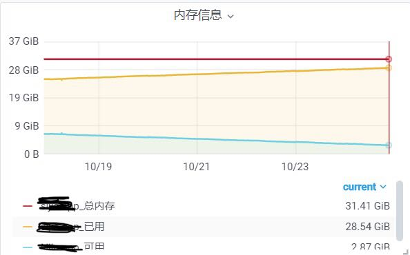
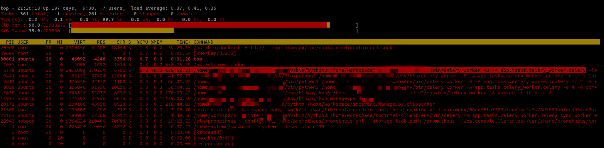

## Celery使用过程中的内存泄露问题

### 问题描述
> celery 异步任务在定时循环的执行异步任务，隔了半个月左右，收到内存告警的信息，连续一周内内存是在缓慢增加的。
> 进行top命令查询内存的占用率是很高的 如下图所示




### 问题定位
> 使用 [Memory Profiler](https://pypi.org/project/memory-profiler/)工具包进行debug，
> 发现异步任务中存在内存增量的地方大多是发送request请求的地方。例如下面的例子
```bash
Line #    Mem usage    Increment  Occurences   Line Contents
============================================================
     5  23.94531 MiB  23.94531 MiB           1   @profile(precision=5)
     6                                         def my_func(url):
     7                                         
     8  25.59375 MiB   1.64844 MiB           1       resp = requests.get(url)
     9  25.59375 MiB   0.00000 MiB           1       print(resp)
    10  25.59375 MiB   0.00000 MiB           1       return resp
```

### 解决过程
> 去网上查询相关Celery内存泄露的问题，在github上Celery项目中发现也有出现类似的内存泄露问题的[issue](https://github.com/celery/celery/issues/4843),
> 主要介绍的是Celery向RabbitMQ发起重连请求的时候，也产生了内存的泄露问题。但是这个问题还没有解决依然处于open状态
>
> 又查询了requests请求的内存泄露问题：使用requests请求时会造成内存泄漏，请求完后内存不会释放。 使用requests.Session()则是使用的一个实例，可以解决这个问题
>  但是，requests.Session()有线程安全问题 最好是一个线程使用一个Session() 但requests.Session()并不会随着线程结束而结束。这个问题尚未完全解决
>
> 这显然不能解决问题又看了看，[Celery官方文档中的Max tasks per child setting](https://docs.celeryproject.org/en/latest/userguide/workers.html#max-tasks-per-child-setting),
> 中说明如果在Celery任务程序中存在内存的泄露问题，但又无法在程序内部控制时。可以使用此选项，您可以配置这个worker在执行了最大的task任务数之后，启动一个新的进程代替并关闭之前的进程。
 
 目前因为程序中使用了大量的requests包，无法很快的去替换并找到不存在内存泄露的办法（而且看了网上的资料大概都是urllib3，urllib，requests都会存在内存的泄露问题）
 
 所以目前可以解决燃眉之急的办法就是使用**CELERYD_MAX_TASKS_PER_CHILD**在worker执行了30个任务数之后，进行重建。
```python
CELERYD_CONCURRENCY = 1  # celery worker 的并发数
CELERYD_PREFETCH_MULTIPLIER = 1  # 一次预取多少消息乘以并发进程数。默认值为4 要禁用预取将其设置1 若为0 将允许工作程序继续使用所需数量的消息。
CELERYD_MAX_TASKS_PER_CHILD = 30  # 池工作进程可以被新任务替换之前执行的最大任务数。默认值是没有限制。
```

但是重建进程并不是很好的解决方案，还是需要研究一下requests请求的内存泄露问题该怎么解决。放在之后进行研究。

***
* From: xaohuihui
* 手搓不易，记得star哦