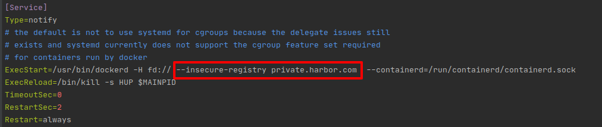

## Docker常用方法

#### Docker简介
docker通过内核虚拟化技术（namespace及cgroups等）来提供容器的资源隔离与安全保障等，由于docker通过操作系统层的虚拟化实现隔离，所以docker容器在运行时，不需要类似虚拟机额外的操作系统开销，提供资源利用率。

#### Docker优点
- 标准化应用发布 docker容器包含了运行环境和可执行程序，可以跨平台和主机使用
- 环境标准化 方便持续集成，提供从运维到测试再到开发的统一运行环境
- 节约时间 快速部署和启动，VM启动一般是分钟级，docker容器启动是秒级
- 节省开支 更高的物理机使用效率；虚拟机至少需要几个GB的磁盘空间，docker容器可以减少到MB级

#### Docker常用命令

##### 安装
以Ubuntu为例：
```bash
sudo apt install -y update
sudo apt-get install -y docker.io
```

##### 拉取镜像使用阿里云加速器解决方法
首先打开配置文件daemon.json，没有就创建一个，添加以下内容
```bash
{
    "registry-mirrors":["https://cabcj35w.mirror.aliyuncs.com"],
    "dns": ["114.114.114.114", "8.8.8.8"]
}
``` 
```bash
sudo systemctl daemon-reload
sudo systemctl restart docker
```


##### 拉取镜像
```bash
sudo docker pull nginx:latest

sudo docker pull myregistry.local:5000/testing/test-image:beta1
```
##### 查看镜像
```bash
sudo docker images
```
#### 使用Docker构建镜像

编写一个Dockerfile文件
```bash
# base image
FROM python:3.7-slim
ENV LANG=C.UTF-8 LC_ALL=C.UTF-8 PYTHONUNBUFFERED=1
COPY ./debian9-source /etc/apt/sources.list
# install netcat
RUN apt-get update && \
    apt-get -y install netcat && \
    apt-get clean

# set timezone
ENV TZ=Asia/Shanghai
RUN ln -snf /usr/share/zoneinfo/$TZ /etc/localtime && echo $TZ > /etc/timezone

# set working directory
WORKDIR /usr/src/app

# run server
CMD ["/usr/src/app/entrypoint.sh"]

```
使用 ```docker build ```构建镜像
```bash
docker build -t example:v1 .
```

##### 修改镜像标签
```bash
docker tag example:v1 example:testv1
```

##### 运行容器
```bash
docker run -d \
--name example_container \
-p 80:80  \
-v /data:/data \
--restart=always \
example
```
##### 查看容器
```bash
docker ps                         # 查看正在运行的容器
docker ps -a                      # 查看所有容器
docker logs -f container_id       # 查看容器日志
```

##### docker 容器和镜像的导入导出

```bash
docker save -o image.tar image_name                                         # 保存镜像到tar
docker load < name.tar                                                      # 从tar载入镜像
docker commit -a "wangshibo" -m "this is test" 351v8541647f myubuntu:v1     # 从容器保存为镜像
docker export -o name.tar r25lfh735jkg                                      # 从容器保存为tar
docker import name.tar example:v1                                           # 容器从tar到镜像
```

> 实际上，既可以使用docker load 命令来导入镜像存储文件到本地镜像库，也可以用docker import命令来导入一个容器快照到本地镜像库 
> 这两者的区别在于容器快照文件将丢弃所有的历史记录和元数据信息（仅保留容器当时的快照状态），而镜像存储文件将保存完整记录，体积也更大，
> 此外，从容器快照文件导入时可以重启指定标签等元数据信息。


##### 设置容器资源大小
```bash
docker stats --no-trunc       # 查看容器资源占用

docker run -ti -d --cpu-shares 512 -m 300M busybox 
docker update --cpu-shares 512 -m 300M container_id
```

##### 设置容器使用无证书的私有仓库
```bash
sudo vim /lib/systemd/system/docker.service
```

其中 ```private.harbor.com```替换为自己的私有仓库地址
重启Docker服务
```bash
sudo systemctl daemon-reload
sudo systemctl restart docker
```

##### 解决Docker下载没有权限问题
错误详情：
```bash
docker.errors.DockerException: Error while fetching server API version: ('Connection aborted.', PermissionError(13, 'Permission denied'))
```
1. Create the docker group.
```bash
sudo groupadd docker
```
2. Add your user to the docker group.

```bash
sudo usermod -aG docker $USER
```
3. Log out and log back in so that your group membership is re-evaluated.
注销并从新登录

4. Verify that you can run docker commands without sudo.
```bash
docker run hello-world
```

***
* From: xaohuihui
* 手搓不易，记得star哦
