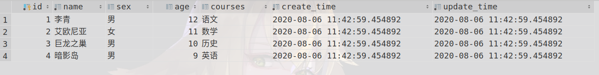
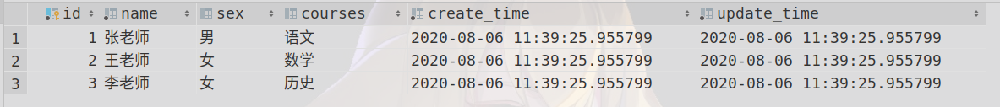

##【最佳实践示例】Logstash JDBC实现ElasticSearch与关系型数据库PostgreSQL近实时同步

在数据全文检索需求越来越大的今天，很多公司都在关系数据库数据的基础上，加上了Elastic Search，来进行数据快速全文检索，所以ElasticSearch与关系型数据库数据进行数据同步就变的尤为重要。本文主要介绍PostgreSQL数据库通过Logstash-JDBC插件与ElasticSearch进行数据的近实时同步。

### 系统配置
-  ElasticSearch:  7.6.2
- PostgreSQL: 10+190ubuntu
- kibana: 7.4.0
- Logstash: 7.6.2


### posgresql 数据库结构
 此数据结构是临时想的，在正常的项目中是不会存在这种结构的，大家见谅。一张学生表，一张老师表，通过课程进行关联。（这种关联关系显示生活中不会这样设计的，但是能说明问题就行一切从简）
 ```sql
 create table student(
    id bigint primary key NOT NULL,
    name varchar(5) not null,
    sex char(1) default '男' ,
    age int check(age>1),
    courses varchar(20),
    create_time TIMESTAMP NOT NULL DEFAULT CURRENT_TIMESTAMP,
    update_time TIMESTAMP NOT NULL DEFAULT CURRENT_TIMESTAMP
 );

 create table teacher(
     id bigint primary key NOT NULL ,
     name varchar(5) not null ,
     sex char(1) default  '男',
     courses varchar(20) default '语文',
     create_time TIMESTAMP NOT NULL DEFAULT CURRENT_TIMESTAMP,
     update_time TIMESTAMP NOT NULL DEFAULT CURRENT_TIMESTAMP
 );
 ```

### 初始化数据




 ### logstash docker-compose配置
 其中logstash.conf 这个文件是logstash指定的配置文件，在下面会有所展示
 ```
 version: '3.7'

 services:
   logstash_test:
     image:
       logstash:7.6.2
     container_name:
       logstash_test
     volumes:
       - './services/logstash_test/data/:/usr/data/'
       - './services/logstash_test/config/logstash.yml:/usr/share/logstash/config/logstash.yml'
       - './services/logstash_test/config/pipelines.yml:/usr/share/logstash/config/pipelines.yml'
       - './services/logstash_test/config/logstash_test.conf:/usr/share/logstash/pipeline/logstash.conf'

 ```
 pipelines.yml  指定路径要包含logstash.conf文件
 ```
 - pipeline.id: student_test_xhh
  path.config: "/usr/share/logstash/pipeline/*.conf"
  pipeline.batch.size: 500
  pipeline.batch.delay: 200
  pipeline.workers: 1

 ```
 logstash.yml
 ```
 config:
   reload:
     automatic: true
     interval: 3s
 ```

 ### logstash配置文件
 使用jdbc进行同步，
 ```
 input {
     jdbc {
         jdbc_connection_string => "jdbc:postgresql://host:port/db_name"
         jdbc_driver_library => "/usr/data/postgresql-42.2.14.jar"
         jdbc_driver_class => "org.postgresql.Driver"
         jdbc_user => "db_user"
         jdbc_password => "db_password"
         jdbc_paging_enabled => true
         jdbc_page_size => 50
         statement_filepath => "/usr/data/jdbc_test.sql"
         record_last_run => true
         clean_run => true
         tracking_column_type => "timestamp"
         tracking_column => "unix_ts_in_secs"
         use_column_value => true
         last_run_metadata_path => "/usr/share/logstash/config/student"
         schedule => "2 * * * * *"
     }
 }

 filter {
     json {
         source => "teacher"
         target => "teacher"
     }
     mutate {
         add_field => {"[@metadata][doc_id]" => "%{id}"}
     }
     mutate {
         remove_field => ["[teacher][id]", "[id]"]
     }

 }

 output {
     stdout {
         codec => rubydebug
     }
     elasticsearch {
         hosts => "http://elasticserver:9200"
         user => "elasticuser"
         password => "elasticpassword"
         document_id => "%{[@metadata][doc_id]}"
         index => "student_test_xhh"
     }
 }

 ```
 **着重几个参数介绍**：
  -  jdbc_connection_string: 连接数据库url， 此字段是说明需要连接的关系型数据库。
 - jdbc_driver_library ：此字段是jdbc连接关系型数据库的驱动文件，本文中logstash是在docker中运行的，所以填写的是docker中这个驱动的文件位置。[ postgresql jdbc驱动下载 ](https://jdbc.postgresql.org/download.html) 其他关系型数据库下载可以在网上搜一下
 - jdbc_driver_class： 驱动程序类，与上面驱动保持致
 - jdbc_user：连接该数据库的用户名
 - jdbc_password：连接该数据库的密码
 - jdbc_paging_enabled：是否启用分页，启用的话会自动在执行的sql语句上进行加上分页
 - jdbc_page_size：分页条数
 - statement_filepath： sql命令的文件地址，比较复杂的sql语句可以写在一个sql文件中，这个参数指定到这个文件的路径就可以进行执行。
 - tracking_column：此字段指定 unix_ts_in_secs，用于标记 Logstash 从数据库读取的最后一个文档，存储在last_run_metadata_path指定的文件下，该值将会用于确定 Logstash 在其轮询循环的下一次迭代中所请求文档的起始值。这样就可以达到增量更新的效果，降低负载，提高效率
 - tracking_column_type: 标注上面unix_ts_in_secs字段的类型，这里使用的是timestamp类型，还支持numeric类型
 - use_column_value: 使用该列的值
 - last_run_metadata_path：此字段指定 unix_ts_in_secs，用于标记 Logstash 从数据库读取的最后一个文档，存储在last_run_metadata_path指定的文件下，该值将会用于确定 Logstash 在其轮询循环的下一次迭代中所请求文档的起始值。
- schedule：其会使用 cron 语法来指定 Logstash 应当以什么频率对 RDS 进行轮询以查找变更。这里所指定的 "2 " 会告诉 Logstash 每 两分钟联系一次表。
- **sql_last_value**：这是一个内置参数，包括 Logstash 轮询循环中当前迭代的起始点，上面 JDBC 输入配置中的 SELECT 语句便会引用这一参数。该字段会设置为 “unix_ts_in_secs”的最新值。在 Logstash 轮询循环内所执行的查询中，其会用作所返回文档的起点。通过在查询中加入这一变量，能够确保不会将之前传播到 Elasticsearch 的插入或更新内容重新发送到 Elasticsearch。_该参数在sql语句中使用_

#### jdbc_test.sql 脚本
```
select s.id,
       s.name,
       s.sex,
       s.age,
       s.courses,
       s.create_time,
       s.update_time,
       cast(jsonb_build_object(
               'id', t.id,
               'name', t.name,
               'sex', t.sex,
               'courses', t.courses
           ) as varchar ) as teacher,
       s.update_time AS unix_ts_in_secs
from student s left join teacher t on s.courses = t.courses
where (s.update_time > cast(:sql_last_value as timestamp ) and s.update_time < NOW())
group by s.id, t.id
order by s.update_time
```
更新时间 记录到unix_ts_in_secs中
sql_last_value： logstash内置参数，若第一次运行unix_ts_in_secs中没有记录，则sql_last_value会从时间戳为0的时间算起。


#### 执行完成es中数据展示
在elk中执行
```
GET /student_test_xhh/_search
```
会显示下面数据
```
{
  "took" : 0,
  "timed_out" : false,
  "_shards" : {
    "total" : 1,
    "successful" : 1,
    "skipped" : 0,
    "failed" : 0
  },
  "hits" : {
    "total" : {
      "value" : 4,
      "relation" : "eq"
    },
    "max_score" : 1.0,
    "hits" : [
      {
        "_index" : "student_test_xhh",
        "_type" : "_doc",
        "_id" : "1",
        "_score" : 1.0,
        "_source" : {
          "create_time" : "2020-08-06T11:42:59.454Z",
          "update_time" : "2020-08-06T11:42:59.454Z",
          "teacher" : {
            "sex" : "男",
            "name" : "张老师",
            "courses" : "语文"
          },
          "sex" : "男",
          "unix_ts_in_secs" : "2020-08-06T11:42:59.454Z",
          "courses" : "语文",
          "name" : "李青",
          "age" : 12,
          "@timestamp" : "2020-08-06T12:10:02.849Z",
          "@version" : "1"
        }
      },
      {
        "_index" : "student_test_xhh",
        "_type" : "_doc",
        "_id" : "2",
        "_score" : 1.0,
        "_source" : {
          "create_time" : "2020-08-06T11:42:59.454Z",
          "update_time" : "2020-08-06T11:42:59.454Z",
          "teacher" : {
            "sex" : "女",
            "name" : "王老师",
            "courses" : "数学"
          },
          "sex" : "女",
          "unix_ts_in_secs" : "2020-08-06T11:42:59.454Z",
          "courses" : "数学",
          "name" : "艾欧尼亚",
          "age" : 11,
          "@timestamp" : "2020-08-06T12:10:02.857Z",
          "@version" : "1"
        }
      },
      {
        "_index" : "student_test_xhh",
        "_type" : "_doc",
        "_id" : "3",
        "_score" : 1.0,
        "_source" : {
          "create_time" : "2020-08-06T11:42:59.454Z",
          "update_time" : "2020-08-06T11:42:59.454Z",
          "teacher" : {
            "sex" : "女",
            "name" : "李老师",
            "courses" : "历史"
          },
          "sex" : "男",
          "unix_ts_in_secs" : "2020-08-06T11:42:59.454Z",
          "courses" : "历史",
          "name" : "巨龙之巢",
          "age" : 10,
          "@timestamp" : "2020-08-06T12:10:02.860Z",
          "@version" : "1"
        }
      },
      {
        "_index" : "student_test_xhh",
        "_type" : "_doc",
        "_id" : "4",
        "_score" : 1.0,
        "_source" : {
          "create_time" : "2020-08-06T11:42:59.454Z",
          "update_time" : "2020-08-06T11:42:59.454Z",
          "teacher" : {
            "sex" : null,
            "name" : null,
            "courses" : null
          },
          "sex" : "男",
          "unix_ts_in_secs" : "2020-08-06T11:42:59.454Z",
          "courses" : "英语",
          "name" : "暗影岛",
          "age" : 9,
          "@timestamp" : "2020-08-06T12:10:02.862Z",
          "@version" : "1"
        }
      }
    ]
  }
}
```
数据同步成功！

原文作者：xaohuihui
转载请表明出处！

参考文献：
https://developer.aliyun.com/article/762059
