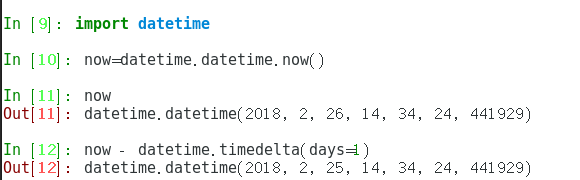

## python操作日期和时间的方法


#### python操作日期和时间的方法
##### 1.将字符串的时间转换为时间戳

复制代码 代码如下:

方法:
```python
a = "2013-10-10 23:40:00"
#将其转换为时间数组
import time
timeArray = time.strptime(a, "%Y-%m-%d %H:%M:%S")
#转换为时间戳:
timeStamp = int(time.mktime(timeArray))
timeStamp == 1381419600
```
##### 2.格式更改
如a = "2013-10-10 23:40:00",想改为 a = "2013/10/10 23:40:00"
方法:先转换为时间数组,然后转换为其他格式
复制代码 代码如下:
```python
timeArray = time.strptime(a, "%Y-%m-%d %H:%M:%S")
otherStyleTime = time.strftime("%Y/%m/%d %H:%M:%S", timeArray)
```
##### 3.时间戳转换为指定格式日期
- 方法一:利用localtime()转换为时间数组,然后格式化为需要的格式,如：
代码如下:
```python
timeStamp = 1381419600
timeArray = time.localtime(timeStamp)
otherStyleTime = time.strftime("%Y-%m-%d %H:%M:%S", timeArray)
otherStyletime == "2013-10-10 23:40:00"
```
- 方法二:
代码如下:
```python
import datetime
timeStamp = 1381419600
dateArray = datetime.datetime.utcfromtimestamp(timeStamp)
otherStyleTime = dateArray.strftime("%Y-%m-%d %H:%M:%S")
otherStyletime == "2013-10-10 23:40:00"
```
##### 4.获取当前时间并转换为指定日期格式
- 方法一:
代码如下:
```python
import time
#获得当前时间时间戳
now = int(time.time())  ->这是时间戳
#转换为其他日期格式,如:"%Y-%m-%d %H:%M:%S"
timeArray = time.localtime(timeStamp)
otherStyleTime = time.strftime("%Y-%m-%d %H:%M:%S", timeArray)
```
- 方法二:
代码如下:
```python
import datetime
#获得当前时间
now = datetime.datetime.now()  ->这是时间数组格式
#转换为指定的格式:
otherStyleTime = now.strftime("%Y-%m-%d %H:%M:%S")
```
#### 5.获得三天前的时间的方法
复制代码 代码如下:
```python
import time
import datetime
#先获得时间数组格式的日期
threeDayAgo = (datetime.datetime.now() - datetime.timedelta(days = 3))
#转换为时间戳:
timeStamp = int(time.mktime(threeDayAgo.timetuple()))
#转换为其他字符串格式:
otherStyleTime = threeDayAgo.strftime("%Y-%m-%d %H:%M:%S")
```
>注:timedelta()的参数有:days,hours,seconds,microseconds

##### 6.给定时间戳,计算该时间的几天前时间
复制代码 代码如下:
```python
timeStamp = 1381419600
#先转换为datetime
import datetime
import time
dateArray = datetime.datetime.utcfromtimestamp(timeStamp)
threeDayAgo = dateArray - datetime.timedelta(days = 3)
#参考5,可以转换为其他的任意格式了
```
##### 7、用Python计算昨天和明天的日期
复制代码 代码如下:
```bash
>>> import datetime #导入日期时间模块
>>> today = datetime.date.today() #获得今天的日期
>>> print today #输出今天日期
2014-01-04
>>> yesterday = today - datetime.timedelta(days=1) #用今天日期减掉时间差，参数为1天，获得昨天的日期
>>> print yesterday
2014-01-03
>>> tomorrow = today + datetime.timedelta(days=1) #用今天日期加上时间差，参数为1天，获得明天的日期
>>> print tomorrow
2014-01-05
>>>
>>> print "昨天:%s， 今天:%s， 明天：%s" % (yesterday, today, tomorrow) #字符串拼接在一起输出，这3天的日期
昨天:2014-01-03， 今天:2014-01-04， 明天：2014-01-05
```
##### 8、python里使用time模块来获取当前的时间
复制代码 代码如下:
```python
#!/usr/bin/python
import time
print (time.strftime("%H:%M:%S"))
## 12 hour format ##
print (time.strftime("%I:%M:%S"))
#：输出
#18:11:30
#6：11:30
```
###### 9、打印出当前的日期的python程序
复制代码 代码如下:
```python
!/usr/bin/python
import time
## dd/mm/yyyy格式
print (time.strftime("%d/%m/%Y"))

#输出：
11/03/2014
```
##### 10、使用datetime模块来获取当前的日期和时间
复制代码 代码如下:
```python
#!/usr/bin/python
import datetime
i = datetime.datetime.now()
print ("当前的日期和时间是 %s" % i)
print ("ISO格式的日期和时间是 %s" % i.isoformat() )
print ("当前的年份是 %s" %i.year)
print ("当前的月份是 %s" %i.month)
print ("当前的日期是  %s" %i.day)
print ("dd/mm/yyyy 格式是  %s/%s/%s" % (i.day, i.month, i.year) )
print ("当前小时是 %s" %i.hour)
print ("当前分钟是 %s" %i.minute)
print ("当前秒是  %s" %i.second)
```
##### 11、获取一个月后的时间
```python
from datetime import datetime
from dateutil.relativedelta import relativedelta
print(datetime.now() + relativedelta(months=1))
```
> 附：日期和时间的格式化参数
复制代码 代码如下:

|符号|说明|
|------|------|
|    %a      |      星期几的简写   |
|    %A      |      星期几的全称   |
|    %b      |      月分的简写       |
|    %B      |      月份的全称       |
|    %c       |      标准的日期的时间串   |
|    %C      |        年份的后两位数字   |
|    %d      |   十进制表示的每月的第几天  |
|    %D      |     月/天/年    |
|    %e      |  在两字符域中，十进制表示的每月的第几天  |
|    %F      |   年-月-日    |
|    %g      | 年份的后两位数字，使用基于周的年  |
|    %G     |   年分，使用基于周的年  |
|    %h     |      简写的月份名  |
|    %H     | 24小时制的小时  |
|    %I       |   12小时制的小时   |
|    %j       |   十进制表示的每年的第几天   |
|    %m    |     十进制表示的月份    |
|    %M     |  十时制表示的分钟数  |
|    %n     |   新行符    |
|    %p     |     本地的AM或PM的等价显示|
|    %r      |    12小时的时间  |
|    %R     | 显示小时和分钟：hh:mm     |
|     %S    |    十进制的秒数     |
|     %t     |    水平制表符       |
|     %T    |   显示时分秒：hh:mm:ss  |  
|     %u     |   每周的第几天，星期一为第一天 （值从0到6，星期一为0） |
|      %U   |  第年的第几周，把星期日做为第一天（值从0到53）|
|      %V   |  每年的第几周，使用基于周的年   |
|     %w   |  十进制表示的星期几（值从0到6，星期天为0）|
|     %W    |   年的第几周，把星期一做为第一天（值从0到53）|
|     %x     |   标准的日期串   |
|     %X    |    标准的时间串   |
|     %y    |  不带世纪的十进制年份（值从0到99）|
|     %Y    | 带世纪部分的十制年份    |
|   %z，%Z   |   时区名称，如果不能得到时区名称则返回空字符。|
|   %%    |   百分号  |

如对本文有疑问，请提交到交流社区，广大热心网友会为你解答！！ [点击进入社区]( http://shequ.jb51.net/)


