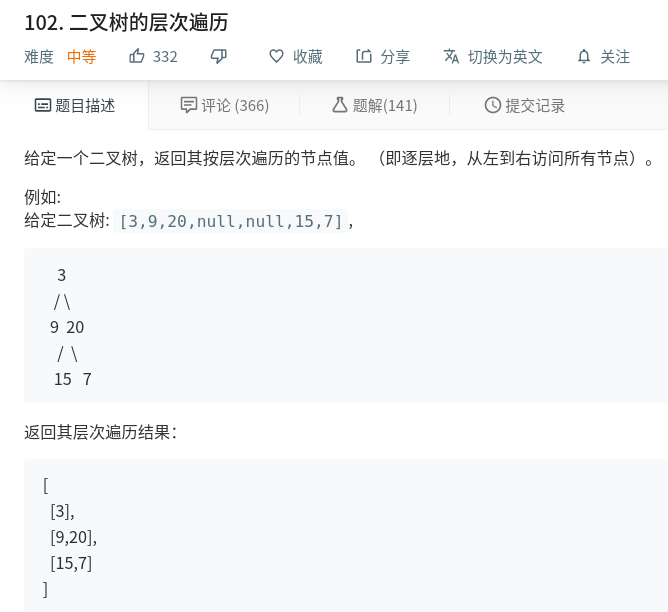

# 二叉树的层次遍历

题目来源：力扣（LeetCode）
链接：https://leetcode-cn.com/problems/binary-tree-level-order-traversal


### 题解：
本题有两种解法，首先第一种肯定是非常明显的广度优先遍历，另一种深度优先遍历的解法。

#### 第一种： 广度优先遍历
>> 广度优先遍历，将遍历的每层的结果放入一个列表中， 该层遍历结束，将整个结果列表加入到总的结果中即可。
>> 时间复杂度 **O(n)** 空间复杂度 **O(1)**(结果的存储空间若不进行计算的话)

__代码如下：__
```python
import collections


class TreeNode:
    def __init__(self, val):
        self.val = val
        self.left = self.right = None


# 广度优先遍历方法
def level_order(root: TreeNode) -> list:
    if not root:
        return []

    queue = collections.deque()  # 申请一个双端队列
    queue.append(root)
    result = []

    # visited = set(root)   # 因为是树的结构，所以只要向下走不会存在重复的情况

    while queue:
        level_size = len(queue)
        current_level = []

        for _ in range(level_size):
            node = queue.popleft()  # 这里从左边出了，下面加入的时候就要加到末尾，若是从右边出，则下面从左边push进去
            current_level.append(node.val)

            if node.left:
                queue.append(node.left)
            if node.right:
                queue.append(node.right)
        result.append(current_level)
    return result


if __name__ == '__main__':
    node1 = TreeNode(1)
    node2 = TreeNode(2)
    node3 = TreeNode(3)
    node4 = TreeNode(4)
    node5 = TreeNode(5)
    node6 = TreeNode(6)
    node7 = TreeNode(7)

    node4.left = node2
    node2.left = node1
    node2.right = node3
    node4.right = node6
    node6.left = node5
    node6.right = node7
    print(level_order(node4))
```

__输出结果：__
```bash
 [[4], [2, 6], [1, 3, 5, 7]]
```

#### 第二种解法：深度优先遍历
>> 进行深度遍历，将没个遍历的节点，加入到每一层对应的结果里面

__代码如下：___
```python
class TreeNode:
    def __init__(self, val):
        self.val = val
        self.left = self.right = None


# 依靠深度优先遍历的算法
def level_order(root: TreeNode) -> list:
    if not root:
        return []

    result = []
    level_size = 0
    result = depth_first_search(root, level_size, result)
    return result


def depth_first_search(root, level, result):
    if not root:
        return []

    if len(result) < level + 1:
        result.append([])

    result[level].append(root.val)
    depth_first_search(root.left, level + 1, result)
    depth_first_search(root.right, level + 1, result)
    return result


if __name__ == '__main__':
    node1 = TreeNode(1)
    node2 = TreeNode(2)
    node3 = TreeNode(3)
    node4 = TreeNode(4)
    node5 = TreeNode(5)
    node6 = TreeNode(6)
    node7 = TreeNode(7)

    node4.left = node2
    node2.left = node1
    node2.right = node3
    node4.right = node6
    node6.left = node5
    node6.right = node7
    print(level_order(node4))

```

__输出结果：__
```bash
[[4], [2, 6], [1, 3, 5, 7]]
```
