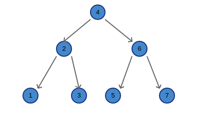

# 二叉树的遍历

本篇算一个资料整理，就是二叉树遍历方法，**有先序遍历（PreOrder）、中序遍历（InOrder）、后序遍历（PostOrder）、广度优先遍历二叉树（breadth_first_search）、深度优先遍历（depth_first_search）**

示例遍历二叉树：
 

二叉树节点格式：
```python
class TreeNode:
    def __init__(self, val):
        self.val = val
        self.left = self.right = None
```


### 1. 先序遍历 PreOrder
>> 先遍历根节点，再遍历左子树，最后遍历右子树
```python
def pre_order(root: TreeNode) -> list:
    if not root:
        return []

    return [root.val] + pre_order(root.left) + pre_order(root.right)

#### 遍历结果
##  [4, 2, 1, 3, 6, 5, 7]
```

### 2. 中序遍历 InOrder
>> 先遍历左子树，再遍历根节点，最后遍历右子树，
```python
def in_order(root: TreeNode) -> list:
    if not root:
        return []

    return in_order(root.left) + [root.val] + in_order(root.right)

#### 遍历结果
##  [1, 2, 3, 4, 5, 6, 7]
```

### 3. 后序遍历
>> 先遍历左子树，再遍历右子树，最后遍历根节点
```python
def post_order(root: TreeNode) -> list:
    if not root:
        return []

    return post_order(root.left) + post_order(root.right) + [root.val]

#### 遍历结果
##    [1, 3, 2, 5, 7, 6, 4]
```

### 4. 广度遍历二叉树 breadth-first-search
>> 按照层级遍历二叉树
```python
import collections

def breadth_first_search(root: TreeNode) -> list:
    """
    这个只是二叉树的广度优先遍历，和图的广度优先不同，返回二叉树的遍历顺序
    :param root: TreeNode
    :return: list
    """

    if not root:
        return []

    queue = collections.deque()  # 申请一个双端队列
    queue.append(root)
    result = []

    # visited = set(root)                    # 因为是树的结构，所以只要向下走不会存在重复的情况

    while queue:
        level_size = len(queue)

        for _ in range(level_size):
            node = queue.popleft()  # 这里从左边出了，下面加入的时候就要加到末尾，若是从右边出，则下面从左边push进去
            result.append(node.val)

            if node.left:
                queue.append(node.left)
            if node.right:
                queue.append(node.right)

    return result

### 输出结果
##   [4, 2, 6, 1, 3, 5, 7]
```

### 5. 深度遍历二叉树 depth-first-search
>> 是一种用于遍历或搜索树或图的算法。 沿着树的深度遍历树的节点，尽可能深的搜索树的分支。 当节点v的所在边都己被探寻过，搜索将回溯到发现节点v的那条边的起始节点。 这一过程一直进行到已发现从源节点可达的所有节点为止
```python
def depth_first_search(root: TreeNode, result=[]) -> list:
    """
    二叉树广度优先遍历，返回广度遍历顺序
    :param root:
    :param result:
    :return:
    """

    if not root:
        return []

    result.append(root.val)
    depth_first_search(root.left, result)
    depth_first_search(root.right, result)
    return result

### 输出结果
##   [4, 2, 1, 3, 6, 5, 7]
```
