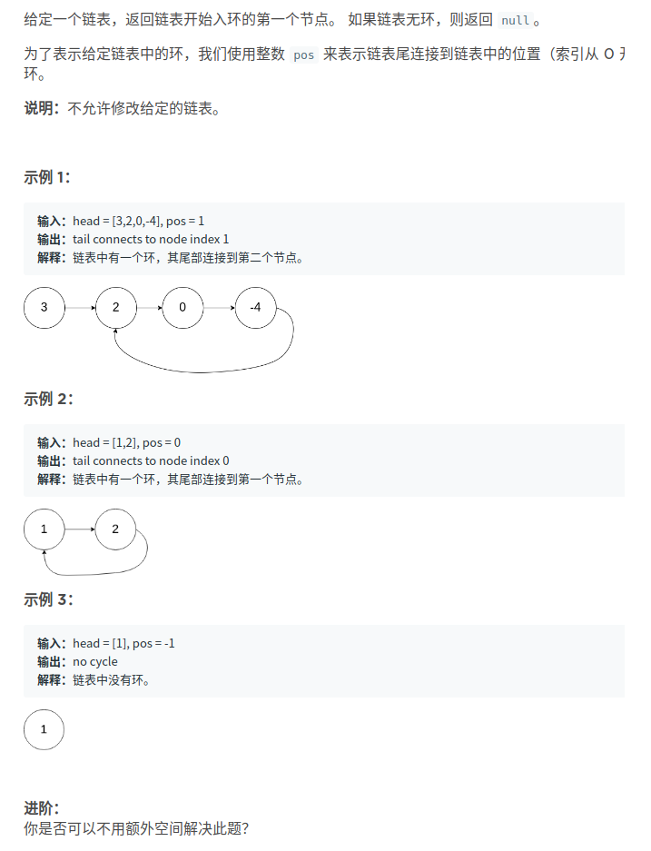
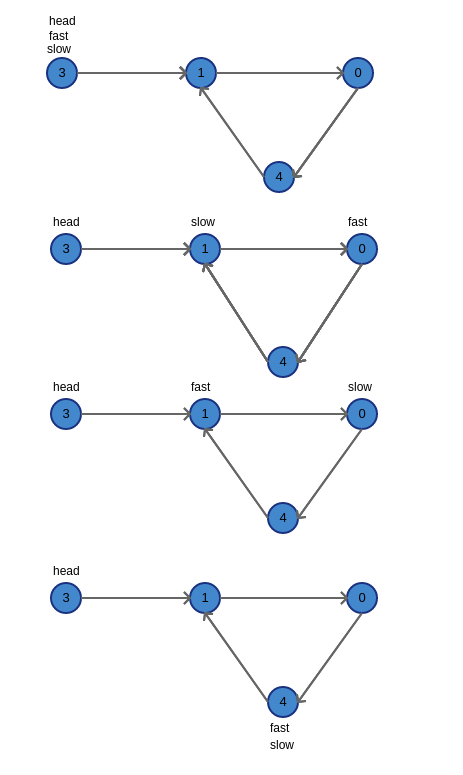
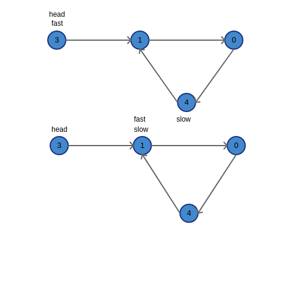
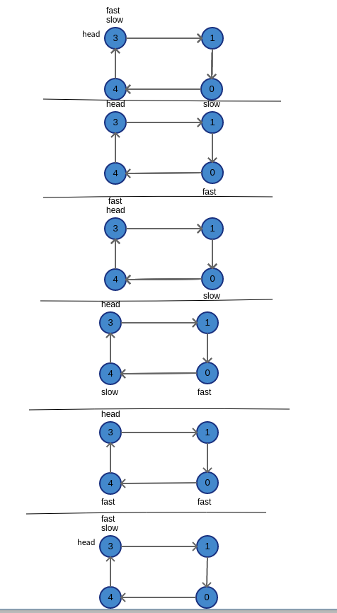

# 环形链表
题目来源：力扣（LeetCode）
链接：https://leetcode-cn.com/problems/linked-list-cycle-ii  



目前考虑到两种解法，但都需要辅助空间， 第一种 **O(n)** 第二种 **O(1)**

#### 第一种 借助辅助字典进行判断
> 将走过的节点都记录在字典中，通过查询字典的key值是否存在来确定是否有环
> 时间复杂度为 **O(n)** , 空间复杂度为 **O(n)**

__代码如下：__
```python
# -*- coding: utf-8 -*-
# @Author   : xaohuihui
# @Time     : 19-12-9
# @File     : detect_cycled_ii.py
# Software  : study

"""
环形链表ii
"""


class ListNode:
    def __init__(self, x):
        self.x = x
        self.next = None


# Number.1
def has_cycle(head: ListNode) -> ListNode:
    result = None
    if head and head.next:
        set_node = set()
        while head:
            if head in set_node:
                result = head
                break
            set_node.add(head)
            head = head.next
    return result


if __name__ == '__main__':
    # head=[3,2,0,4] pos= 1
    node1 = ListNode(3)
    node2 = ListNode(2)
    node3 = ListNode(0)
    node4 = ListNode(4)

    node1.next = node2
    node2.next = node3
    node3.next = node4
    node4.next = node2

    result_node = has_cycle(node1)
    if result_node:
        start = node1
        i = 0
        while start:
            if result_node == start:
                print(f"tail connects to node index {i}")
                break
            i += 1
            start = start.next
    else:
        print("no cycle")
```

**输出如下：**
> tail connects to node index 1

#### 第二种解法 快慢指针
> 使用快慢指针，快指针每次走两步，慢指针每次走一步。
>如果单链表中有环，快慢指针肯定会相遇，如图a.所示，在相遇后，将快指针指向开始位置，结束第一次循环。
> 第二次循环，将快指针变为没次走一步，慢指针每次走一步，如图b.所示，如果再次相遇，该点就为环点
> 时间复杂度为 **O(n)** , 空间复杂度为 **O(1)**
> **特别注意：** 若环点就在起始节点，第一次快慢指针相遇一定在环点 ，则fast和slow此时都指向起始节点，则第二次循环不必执行，如图c.所示


**图a.**


**图b.**


**图b.**


__代码如下：__
```python
# -*- coding: utf-8 -*-
# @Author   : xaohuihui
# @Time     : 19-12-9
# @File     : detect_cycled_ii.py
# Software  : study

"""
环形链表ii
"""


class ListNode:
    def __init__(self, x):
        self.x = x
        self.next = None


# NUmber.2
def has_cycle(head: ListNode) -> ListNode:
    result = None
    if head and head.next:
        fast = slow = head
        while fast and fast.next:
            fast = fast.next.next
            slow = slow.next
            if fast == slow:
                fast = head
                break
        else:
            return result

        while fast != slow:
            fast = fast.next
            slow = slow.next
        result = fast
    return result


if __name__ == '__main__':
    # head=[3,2,0,4] pos= 0
    node1 = ListNode(3)
    node2 = ListNode(2)
    node3 = ListNode(0)
    node4 = ListNode(4)

    node1.next = node2
    node2.next = node3
    node3.next = node4
    node4.next = node1

    result_node = has_cycle(node1)
    if result_node:
        start = node1
        i = 0
        while start:
            if result_node == start:
                print(f"tail connects to node index {i}")
                break
            i += 1
            start = start.next
    else:
        print("no cycle")
```

**输出结果**
> tail connects to node index 0
